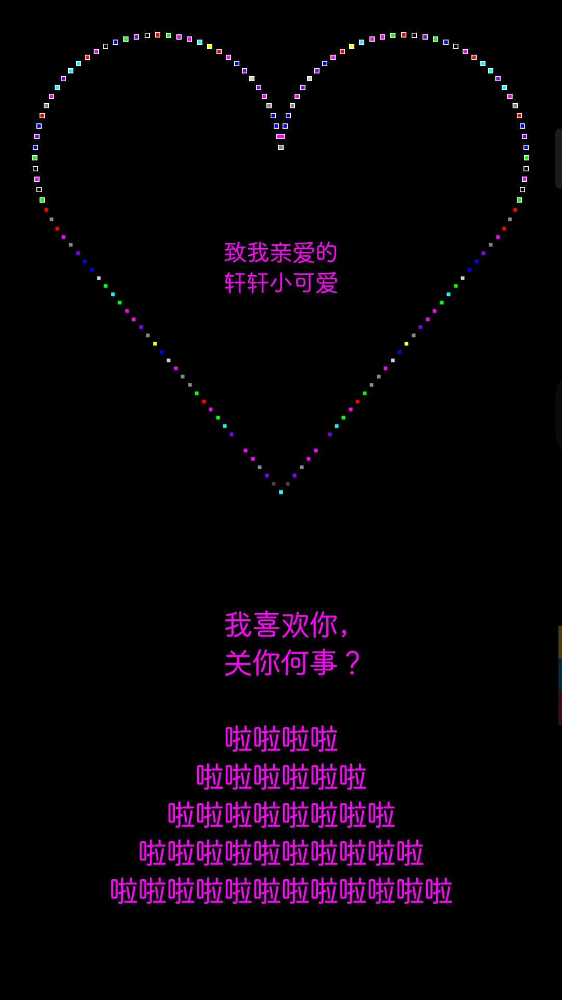

致轩轩小可爱
===

予亲爱的小女儿——LYX，愚人节快乐！！！！！！

```
        .∧＿∧　　　　∧＿∧
        (*･ω･ヾ⌒∨⌒ヽ･ω･*)
        (  ⊃( 好　き )⊂  )
        (＿＿⊃＼_ _／⊂＿＿)
```




---

## 介绍

很久以前做的，看例程学习时觉得好玩，就改了一下。

（千万别告诉她其实我只是改了个文字！！！）

代码很短，应该都能看懂。


## 核心代码

```E4A
过程 画心(n 为 整数型)
	如果 n<18 则
		x=求余弦(角度转弧度(n*5))*70*调整系数+90*调整系数
		y=90*调整系数-求正弦(角度转弧度(n*5))*70*调整系数
		qqq=230*调整系数-求余弦(角度转弧度(n*5))*70*调整系数
		www=90*调整系数-求正弦(角度转弧度(n*5))*70*调整系数
	否则如果 n=18 则
		x=90*调整系数
		y=20*调整系数
		qqq=230*调整系数
		www=20*调整系数
	否则如果 n>18 且 n<36 则
		x=90*调整系数-求余弦(角度转弧度(180-n*5))*70*调整系数
		y=90*调整系数-求正弦(角度转弧度(180-n*5))*70*调整系数
		qqq=求余弦(角度转弧度(180-n*5))*70*调整系数+230*调整系数
		www=90*调整系数-求正弦(角度转弧度(180-n*5))*70*调整系数
	否则如果 n=36 则
		x=20*调整系数
		y=90*调整系数
		qqq=300*调整系数
		www=90*调整系数
	否则如果 n>36 且 n<46 则
		x=90*调整系数-求余弦(角度转弧度(n*5-180))*70*调整系数
		y=90*调整系数+求正弦(角度转弧度(n*5-180))*70*调整系数
		qqq=230*调整系数+求余弦(角度转弧度(n*5-180))*70*调整系数
		www=90*调整系数+求正弦(角度转弧度(n*5-180))*70*调整系数
	否则如果 n>=46 则
		画板1.画笔粗细 = 10
		画板1.画笔颜色 = 背景颜色
		画板1.画点(x+(160*调整系数-x)/30*(n-46),y+(280*调整系数-y)/30*(n-46))
		画板1.画点(qqq-(qqq-160*调整系数)/30*(n-46),www+(280*调整系数-www)/30*(n-46))
		画板1.画笔粗细 = 7
		画板1.画笔颜色 = 随机颜色()
		画板1.画点(x+(160*调整系数-x)/30*(n-46),y+(280*调整系数-y)/30*(n-46))
		画板1.画点(qqq-(qqq-160*调整系数)/30*(n-46),www+(280*调整系数-www)/30*(n-46))
	结束 如果
	如果 n<46 则
		画板1.画笔粗细 = 10
		画板1.画笔颜色 = 背景颜色
		画板1.画点(x,y)
		画板1.画点(qqq,www)
		画板1.画笔粗细 = 7
		画板1.画笔颜色 = 随机颜色()
		画板1.画点(x,y)
		画板1.画点(qqq,www)
	结束 如果
结束 过程
```


## 随机颜色以及白色边框

```E4A
事件 时钟1.周期事件()
	n=n+1'一个点一个点的画心,勿动！如果变成+2 那就 间隔一个点 才画一个点
	画心(n)
	如果 n>75 则'本程序的心形一共75*2=150 个点,,,,勿动,修改了 就画不成心了
		'时钟1.时钟周期=0''''''''''这是画心 完成,停止 时钟,如果不停止,那就不是心了
		'画板1.画文字(90*调整系数,120*调整系数,"I Love You !")'这里是画你想要的字,关于文字的位置,坐标 需要你自己控制计算
		n = 0
		如果 背景颜色 = 白色 则
			背景颜色 = 随机亮颜色() ' 自己实现的方法
		否则
			背景颜色 = 白色
		结束 如果
		如果 时钟1.时钟周期 >= 40 则
			时钟1.时钟周期 = 时钟1.时钟周期-5
		否则
			时钟1.时钟周期 = 85
		结束 如果
		标签1.字体颜色 = 随机亮颜色()
		编辑框1.字体颜色 = 随机亮颜色()
		如果 编辑框1.字体颜色 = 黑色 则
			编辑框1.字体颜色 = 白色
		结束 如果
	结束 如果
结束 事件
```


> 画心核心算法来自：E4A自带例程《动态爱心精装版》
>
> 弹窗库来自：ok安卓50信息框
>
> ~~雪花库来自：厨师_多功能扩展类库~~（由于只有左半屏的bug，已删除）